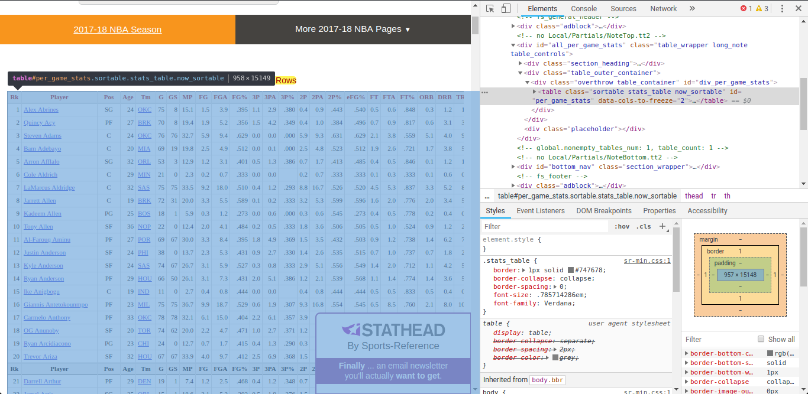

Basketball Reference is a website that contains a lot of cool statistics about the NBA.

The site has a very intuitive way to modify, share and download stats tables as csv or Excel files, but if you want to grab many of them, using web scraping can make you life a lot easier!

For this tutorial, we will obtain the NBA Totals, Per Game, and Advanced stats for every season. The same process can be applied to multiple other cases with a few adaptations.

## Libraries

To do this, we will use the following Python libraries:

- `requests`: This library will be used to make a get request in order to obtain the web page HTML; 
- `BeautifulSoup`: After obtaining the web page, we can use BeautifulSoup to get specific contents we want from the HTML code; 
- `Pandas`: After getting the table content, we can use Pandas to save it and then export it as a csv file. 

## Scraping a single table

So, first let's look at a page that contains data we want, for example the [2018 Per game stats page](https://www.basketball-reference.com/leagues/NBA_2018_per_game.html). This webpage contains a very big table, where each row represents a player and their stats in the 2018 Season, and what we want to do is grab this table and save it in a Pandas Dataframe.

In order to extract the data from the page, we need to identify how the data is being presented shown. Clicking with the right button on the table and selecting the Inspect option, we can see that the data is stored in a HTML table with the id `per_game_stats`. 



Knowing the HTML element id or class is very useful. In this specific case, there is only one table, so simply getting the but what if there's more than one in the page? With the id from the table we want, we can specify which of the elements we want.

Now that we know what we want to extract from the page, let's get to it!

Let's start importing the libraries we'll need:

```python
import numpy as np
import pandas as pd
import requests
from bs4 import BeautifulSoup
```

Then, we can get the page html content sending a GET request to the website:

```python
stats_page = requests.get('https://www.basketball-reference.com/leagues/NBA_2018_per_game.html')
```

This returns a Response object, and we can access the web page HTML with the content attribute.

```python
content = stats_page.content
```

After obtaining the page HTML, we can now use Beautiful Soup to parse it's content. Then, we can use the method `find` to extract a single element from the page. The first argument we pass is the name from the HTML element we want, in this case "table", and in the second argument we can pass a dictionary specifying the attributes we want the element to have. In this case we want the table with the id "per_game_stats".

```python
soup = BeautifulSoup(content, 'html.parser')
table = soup.find(name='table', attrs={'id':'per_game_stats'})
```

This method returns a single Beautiful Soup Tag element containing the table. Alternatively, if you wanted to extract multiple elements instead of one, you could use the method `findAll`, which returns a list of elements.

Now that we have the table, we can use Pandas to save it in a Data Frame. To do this, we can convert the table element obtained to string and use the `read_html()` method from Pandas to read the data from the table. One thing to note is that this method returns a list of Data Frames, so we only need the first array position.

```python
html_str = str(table)
df = pd.read_html(html_str))[0]
```

And it's done! 

## Automating the task for multiple pages

Now that we learned how to extract a table, we can automate this process to scrape data from all NBA Seasons. One thing to notice looking at the URL used in the last section, is that by changing the year in it we can access data from the other seasons. With this mind, we can use a loop to access all the data.

We first get a list of years, from 1950 to 2018, and then use a `for` loop to iterate it, replacing the current year in the URL for each iteration and repeating the same process to obtain the Data Frame for each season and append it to the a main variable. 

```
# Get all values from 1950 to 2018, with interval of 1
years = np.arange(1950,2019,1)
base_url = 'https://www.basketball-reference.com/leagues/NBA_{}_per_game.html'

seasons_per_game = pd.DataFrame()

for year in years:
    req_url = base_url.format(year)
    req = requests.get(req_url)
    soup = BeautifulSoup(req.content, 'html.parser')
    table = soup.find('table', {'id':'per_game_stats'})
    df = pd.read_html(str(table))[0]
    df['Year'] = year
    
    seasons_per_game = seasons_per_game.append(df)
```

Thats's it! Now you can save the Data Frame and use it anytime you want, and use the data to do some Data Analysis and Visualizations, even work on some Machine Learning models!


